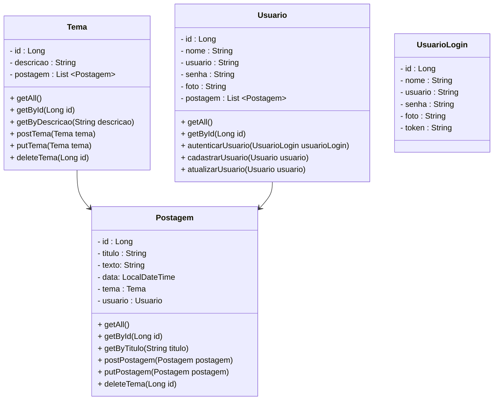

# Projeto Blog Pessoal

 

## Diagrama de Classes

```mermaid
classDiagram
class Tema {
  - id : Long
  - descricao : String
  - postagem : List ~Postagem~
  + getAll()
  + getById(Long id)
  + getByDescricao(String descricao)
  + postTema(Tema tema)
  + putTema(Tema tema)
  + deleteTema(Long id)
}
class Postagem {
  - id : Long
  - titulo : String
  - texto: String
  - data: LocalDateTime
  - tema : Tema
  - usuario : Usuario
  + getAll()
  + getById(Long id)
  + getByTitulo(String titulo)
  + postPostagem(Postagem postagem)
  + putPostagem(Postagem postagem)
  + deleteTema(Long id)
}
class Usuario {
  - id : Long
  - nome : String
  - usuario : String
  - senha : String
  - foto : String
  - postagem : List ~Postagem~
  + getAll()
  + getById(Long id)
  + autenticarUsuario(UsuarioLogin usuarioLogin)
  + cadastrarUsuario(Usuario usuario)
  + atualizarUsuario(Usuario usuario)
}
class UsuarioLogin{
  - id : Long
  - nome : String
  - usuario : String
  - senha : String
  - foto : String
  - token : String
}
Tema --> Postagem
Usuario --> Postagem
```
